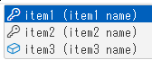
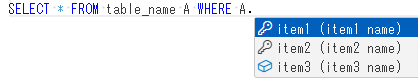

# monaco editorの言語拡張
monaco editorの言語拡張を作る際のサンプル

## 概要
issueに上がっていても対応されない機能があるので無理やり実装してみる

## 対象
monaco-editor-0.52.2

## CompletionItemKindの追加

サジェストの項目の種類を追加





※SQLの言語拡張を作成する際に、テーブルやキー項目用にアイコンを変更したかったので…

[CustomizeCompletionItemKind.js](./CustomizeCompletionItemKind.js)

```` javascript
        addCompletionItemKind("Key", codicons.Codicon.key);
        addCompletionItemKind("Table", codicons.Codicon.table);
````
addCompletionItemKind
 kind : monaco.languages.CompletionItemKindに追加するキー
 icon : アイコン

※直接追加するAPIが用意されていないので、\vs\editor\common\languages.ts内のtoIconを上書き

## SQLエイリアスからテーブル名の取得

SQLの言語拡張を作成する際に、テーブルに応じたフィールドを取得するために位置からテーブル名を取得

※毎回全体をパースし直さない用にmonaco editor内のデータを使用しているためバージョンが変わると使用できなくなると思います…。

[GetTableName.js](./GetTableName.js)

```` SQL
SELECT A.item FROM table_name A
````

A.と入力した際に、「table_name」を取得




※GetTableName.js内の言語は、monaco.languages.registerでsql2としているので自分で使うときは適宜変更してください。
